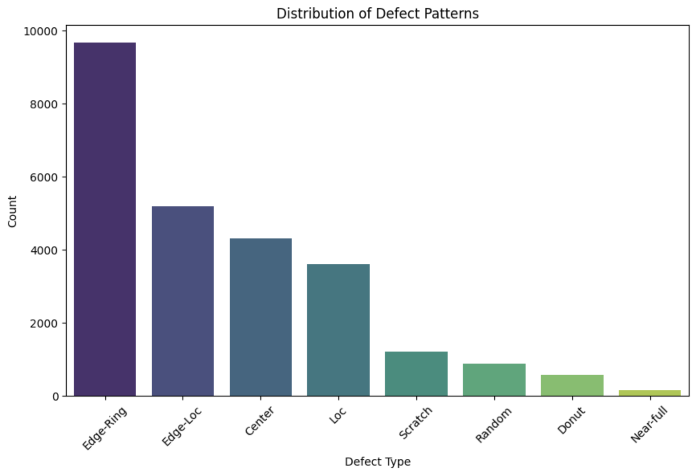
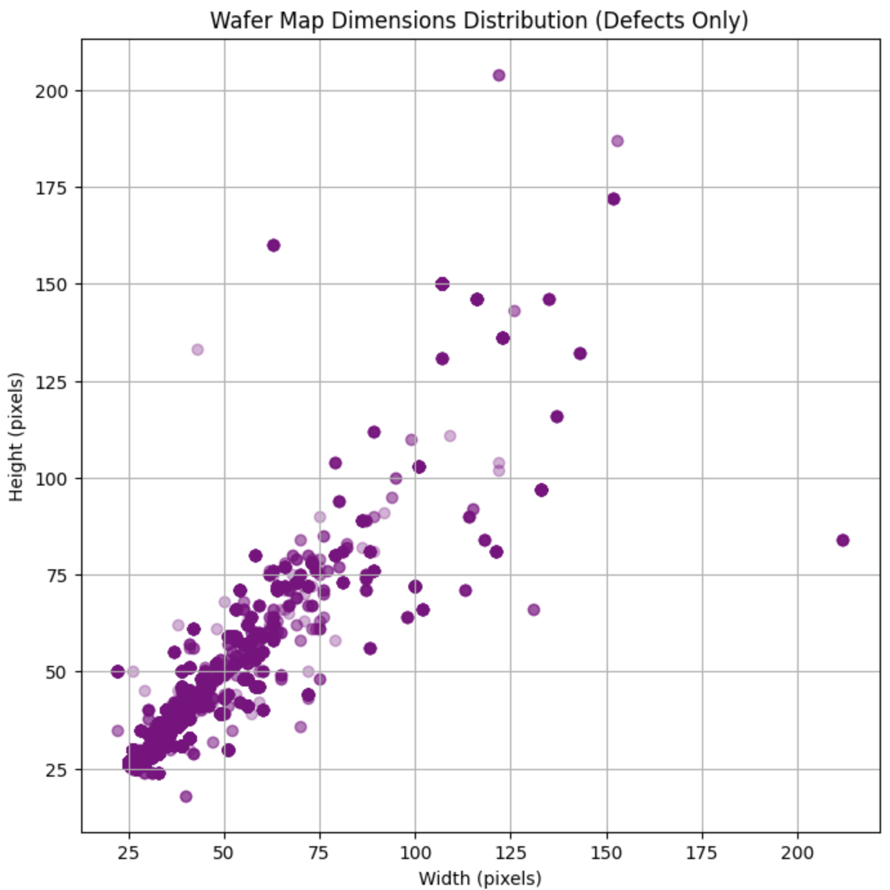
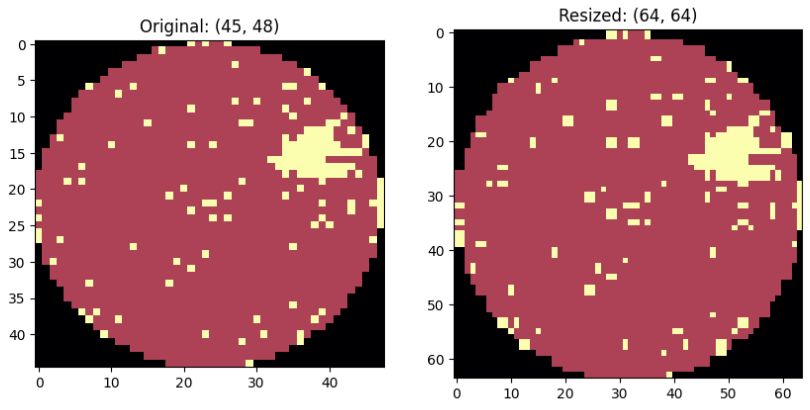
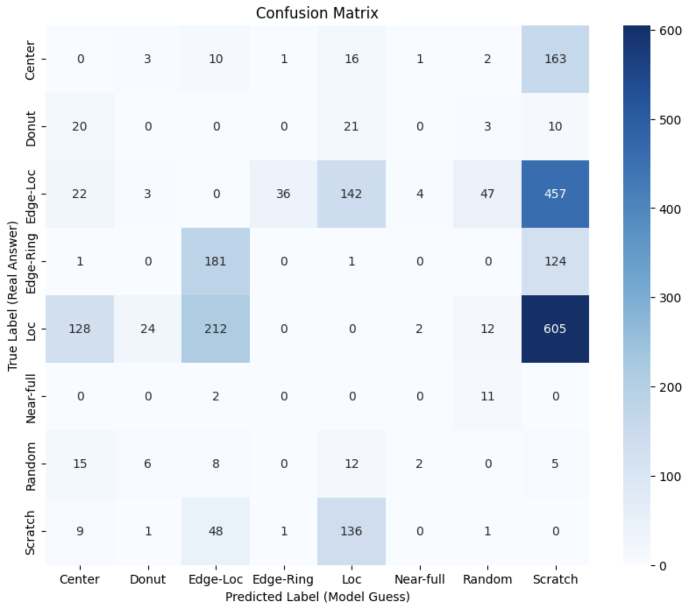
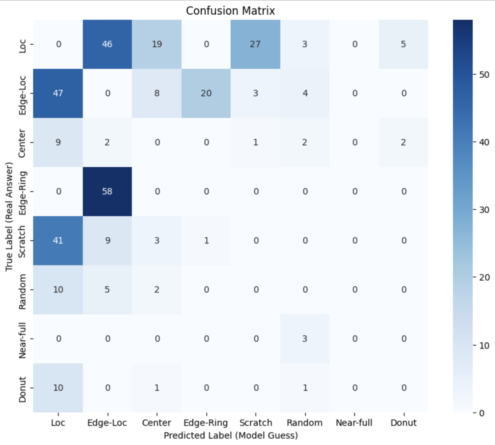
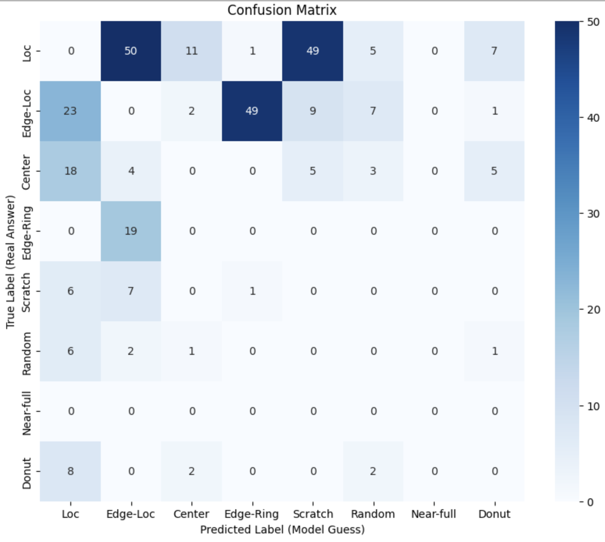
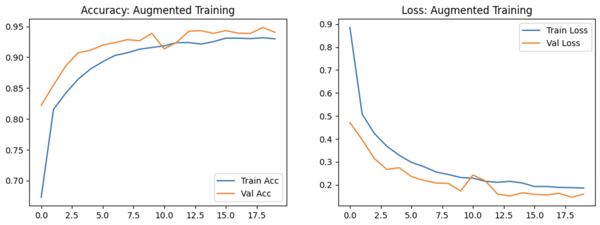

# 🔬 Wafer Map Defect Classification using CNN

An automated defect classification system for semiconductor wafer maps using Convolutional Neural Networks (CNN) to identify and categorize spatial defect patterns.



## 📋 Table of Contents
- [Overview](#overview)
- [Business Value](#business-value)
- [Dataset](#dataset)
- [Installation](#installation)
- [Project Workflow](#project-workflow)
- [Results](#results)
- [Model Architecture](#model-architecture)
- [Usage](#usage)

---

## 🎯 Overview

This project develops an **Automated Defect Classification** system using **Convolutional Neural Networks (CNN)** to automatically categorize spatial defect patterns on semiconductor wafer maps. The system aims to:

- Replace manual inspection processes
- Reduce human error in defect classification
- Accelerate identification of process anomalies
- Enable faster Root Cause Analysis (RCA)

## 💼 Business Value

In semiconductor manufacturing, wafer map patterns provide critical insights into fabrication process health. This automated system delivers:

### **Yield Ramp-Up** 🚀
Rapid identification of defect clusters (e.g., Scratch, Edge-Ring) enables process engineers to perform Root Cause Analysis faster.

### **Cost Reduction** 💰
Automating classification reduces the "man-to-machine" ratio and minimizes misclassification risks due to operator fatigue.

### **Process Monitoring** 🔍
Detecting systematic patterns vs. random defects helps pinpoint specific faulty process steps, such as:
- Etching uniformity issues
- CMP (Chemical Mechanical Planarization) handling errors
- Equipment-specific failures

---

## 📊 Dataset

**Source**: [WM811K Wafer Map Dataset](https://www.kaggle.com/datasets/qingyi/wm811k-wafer-map)

### Dataset Characteristics:
- **Scale**: 811,000+ wafer maps
- **Format**: 2D images with pixel values representing die status
  - `0`: Background
  - `1`: Good Die
  - `2`: Defective Die
- **Classes**: 9 categories
  - 8 defect patterns: Center, Donut, Edge-Loc, Edge-Ring, Loc, Random, Scratch, Near-full
  - 1 normal class: None
- **Challenge**: Natural class imbalance (common in manufacturing data)

### Defect Pattern Distribution



The dataset exhibits significant class imbalance, with Edge-Ring and Edge-Loc being the most common defect types.

---

## 🛠️ Installation

### Prerequisites
- Python 3.11+
- pip package manager

### Setup

1. **Clone the repository**
```bash
git clone https://github.com/NUSSETO/Semiconductor_Project.git
cd Semiconductor_Project
```

2. **Create virtual environment** (recommended)
```bash
python -m venv venv
source venv/bin/activate  # On Windows: venv\Scripts\activate
```

3. **Install dependencies**
```bash
pip install -r requirements.txt
```

4. **Download dataset**
- Download the WM811K dataset from [Kaggle](https://www.kaggle.com/datasets/qingyi/wm811k-wafer-map)
- Place `LSWMD.pkl` in the project root directory

---

## 🔄 Project Workflow

### 1. **Exploratory Data Analysis (EDA)**
- Analyze class distribution
- Visualize spatial defect patterns
- Understand data characteristics

### 2. **Data Preprocessing**


- Resize wafer maps to standardized dimensions (64×64 and 96x96 for comparative analysis)
- Apply denoising techniques
- Handle class imbalance

### 3. **Model Architecture**
Design and train CNN tailored for spatial pattern recognition:
- Convolutional layers for feature extraction
- MaxPooling for dimensionality reduction
- Dense layers for classification
- Dropout for regularization

### 4. **Training & Optimization**

- Monitor training/validation metrics
- Optimize hyperparameters
- Implement data augmentation

### 5. **Error Analysis**
Investigate model performance through confusion matrices:

**Initial Model Performance:**


**After First Optimization:**


**Final Model Performance:**


---

## 📈 Results

### Model Performance Metrics

| Metric | Value |
|--------|-------|
| **Overall Accuracy** | ~94% |
| **Training Time** | ~20 minutes |
| **Model Size** | ~19 MB |

### Key Achievements
- ✅ Successfully classified 8 distinct defect patterns
- ✅ Handled severe class imbalance through data augmentation
- ✅ Achieved production-ready accuracy for manufacturing deployment

### Training History


---

## 🏗️ Model Architecture

```python
Sequential Model:
├── Conv2D (32 filters, 3×3)
├── MaxPooling2D (2×2)
├── Conv2D (64 filters, 3×3)
├── MaxPooling2D (2×2)
├── Conv2D (128 filters, 3×3)
├── MaxPooling2D (2×2)
├── Conv2D (256 filters, 3×3)
├── MaxPooling2D (2×2)
├── Flatten
├── Dense (128 units)
├── Dropout (0.5)
└── Dense (9 units, softmax)
```

**Key Features:**
- Input shape: 96×96×1 (grayscale images)
- Activation: ReLU for hidden layers, Softmax for output
- Optimizer: Adam
- Loss function: Categorical Crossentropy

---

## 🚀 Usage

### Running the Notebook

1. **Start Jupyter Notebook**
```bash
jupyter notebook
```

2. **Open `main.ipynb`**

3. **Run all cells** or execute step-by-step:

### Quick Start Example

```python
# Load the trained model
from tensorflow.keras.models import load_model
model = load_model('wafer_defect_model.h5')

# Predict on new wafer map
prediction = model.predict(preprocessed_wafer_map)
defect_class = np.argmax(prediction)
```

---

## 📁 Project Structure

```
Semiconductor_Project/
├── main.ipynb              # Main analysis notebook
├── main.html               # For easy access
├── requirements.txt        # Python dependencies
├── .gitignore              # Git ignore rules
├── README.md               # This file
├── img/                    # Visualization images
│   ├── Defect_distribution.png
│   ├── Defect_size.png
│   ├── Resize_example.png
│   ├── Training_history.png
│   ├── Original_CM.png
│   ├── Second_CM.png
│   └── Final_CM.png
└── data/
    └── LSWMD.pkl           # Dataset (not tracked in git)
```

---

## 🙏 Acknowledgments

- Dataset: [WM811K Wafer Map Dataset](https://www.kaggle.com/datasets/qingyi/wm811k-wafer-map)
- Inspired by semiconductor manufacturing quality control practices
- Built with TensorFlow/Keras/Antigravity/Gemini

---

**Author**: Jason Huang  
**Focus**: Semiconductor Manufacturing Quality Control, Machine Learning, Data Analysis
